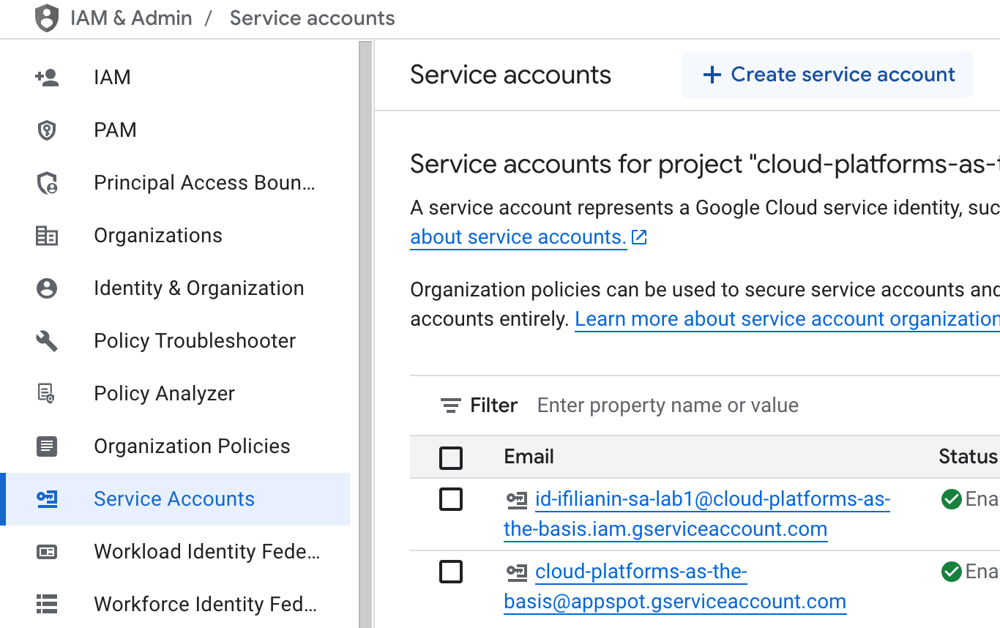
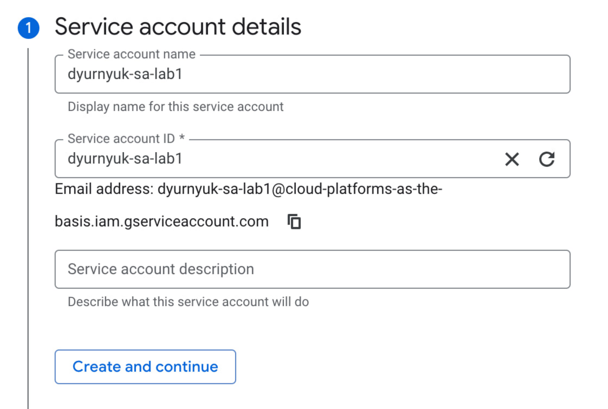
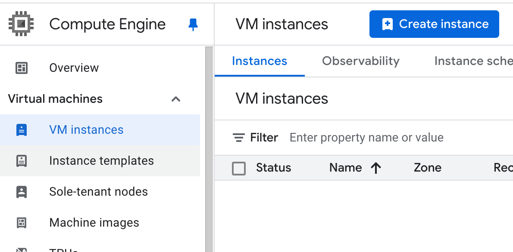
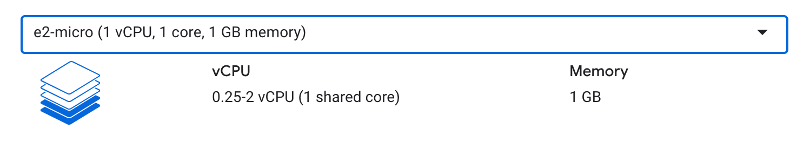
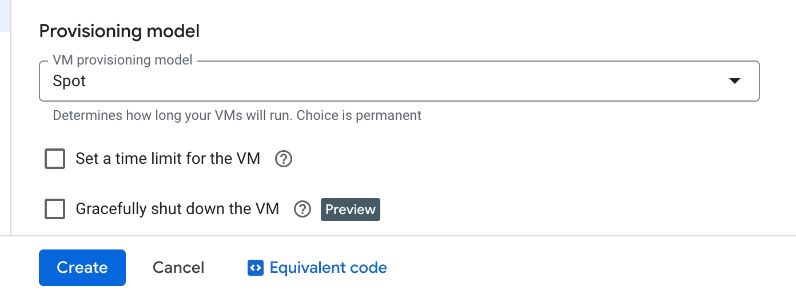
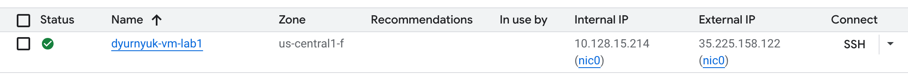
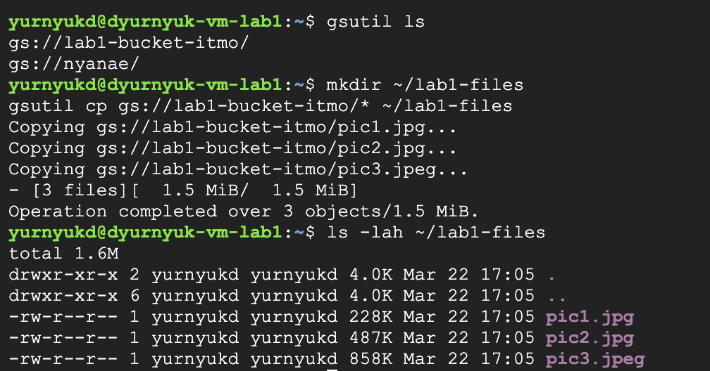
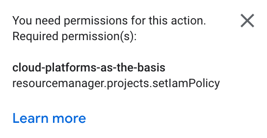

<div align="center">

University: [ITMO University](https://itmo.ru/ru/) 

Faculty: [FICT](https://fict.itmo.ru)

Course: [Cloud platforms as the basis of technology entrepreneurship](https://itmo-ict-faculty.github.io/cloud-platforms-as-the-basis-of-technology-entrepreneurship/)

Year: 2024/2025

Group: U4225

Author: Yurnyuk Dmitry Olegovich

Lab: Lab1

Date of create: 22.03.2025

Date of finished: 22.03.2025

</div>

---

## Ход работы

### Шаг 1: Создание Service Account с ролью Storage Admin

1. Перешел в раздел **IAM & Admin** > **Service Accounts**.
2. Создал новый service account с именем `dyurnyuk-sa-lab1`.
3. Назначил роль **Storage Admin**.




### Шаг 2: Создание виртуальной машины в Google Cloud

1. Перешел в раздел **Compute Engine** > **VM instances**.
2. Создал новую виртуальную машину с именем `dyurnyuk-vm-lab1`.
3. Выбрал тип машины **e2-micro** и включил режим **spot**.





### Шаг 3: Копирование файлов из Cloud Storage в VM

1. Подключился к виртуальной машине через **SSH**.
2. Использовал команду `gsutil cp` для копирования файлов из бакета `lab1-bucket-itmo` в локальную папку на VM.
3. Проверил наличие файлов командой `ls -lah`.

```
gsutil cp gs://lab1-bucket-itmo/* ~/lab1-files
ls -lah ~/lab1-files
```




### Шаг 4: Изменение роли Service Account на Compute Viewer

1. Перешел в **IAM & Admin** > **IAM**.
2. Не смог изменить роль service account `dyurnyuk-sa-lab1`, поскольку изначально была роль **Compute Admin** и доступа к редактированию не было.



