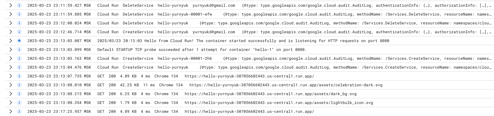

University: [ITMO University](https://itmo.ru/ru/) 

Faculty: [FICT](https://fict.itmo.ru)

Course: [Cloud platforms as the basis of technology entrepreneurship](https://itmo-ict-faculty.github.io/cloud-platforms-as-the-basis-of-technology-entrepreneurship/)

Year: 2024/2025

Group: U4225

Author: Yurnyuk Dmitry Olegovich

Lab: Lab2

Date of create: 23.03.2025

Date of finished: 23.03.2025

---

## Ход работ

В данной лабораторной работе был создан сервис на базе Google Cloud Run с использованием дефолтного контейнера **hello** и минимальными ресурсами. Было выполнено **тестирование сервиса**, **анализ логов и метрик**, а также **изменение порта** и **переключение трафика** между версиями для тестирования работы с разными конфигурациями.

### Шаг 1: Создание Cloud Run сервиса с минимальными ресурсами

1. В разделе **Cloud Run** создан новый сервис `hello-yurnyuk` с использованием дефолтного контейнера **hello** и минимальными настройками ресурсов.
2. Заданы следующие параметры:
   - **Memory limit** — 256MiB;
   - **CPU limit** — 1 CPU.

### Шаг 2: Тестирование сервиса

1. После успешного развертывания сервиса перешел по ссылке, предоставленной Cloud Run.
2. Проверил корректность работы сервиса — сервис успешно отобразил сообщение **It's running!**.

### Шаг 3: Анализ логов и метрик (порт 8080)

1. Перешел в раздел **Logs** и проанализировал журналы сервиса, где зафиксированы все запросы, их ответы и время обработки. Логи позводили подтвердить стабильность и производительность работы сервиса.

2. Перешел в раздел **Metrics** и проанализировал следующие метрики:
   - **Request count** — количество запросов: `0`.
   - **Request latencies** — средняя задержка: `10 ms`.
   - **Container memory utilization** — объем использованной памяти: `±10%`.
   - **Container CPU utilization** — процент использования процессора: `1%`.

Эти метрики показали нормальную работу сервиса и оптимальное использование ресурсов при минимальных настройках.

### Шаг 4: Изменение порта на 8090 и развертывание новой версии

1. Открыл настройки сервиса и выбрал **Edit & Deploy New Revision** для создания новой ревизии, указав порт **8090** вместо порта 8080.
2. После развертывания новой версии сервиса проверил его работу, перейдя по ссылке. Сервис успешно обработал запросы на порту 8090 и выдал корректный ответ **It's running!**, что подтверждает его работоспособность на новом порту.

### Шаг 5: Анализ метрик при работе на порту 8090

1. Открыл раздел **Logs**. Там, просмотрев журналы сервиса, убедился, что порт работает стабильно.

   
2. Перешел в раздел **Metrics** для новой версии сервиса с портом 8090 и повторно проанализировал ключевые метрики:
   - **Request count** — количество запросов: `0`.
   - **Request latencies** — средняя задержка: `10 ms`.
   - **Memory usage** — объем использованной памяти: `±1%`.
   - **CPU usage** — процент использования процессора: `4%`.

Сравнив значения метрик на порту 8090 с предыдущими, можно сделать выводы о незначительном, но существующем влиянии порта на производительность и загрузку ресурсов.

### Шаг 6: Переключение трафика между версиями

1. Перешел на страницу управления трафиком сервиса (**Revisions**).
2. Установил распределение трафика, направив 50% на версию с портом 8080 и 50% на версию с портом 8090, чтобы наблюдать, как сервисы обрабатывают запросы в условиях смешанного трафика.
3. Повторил тестирование, наблюдая распределение запросов между версиями. Обе версии работали стабильно и корректно обрабатывали запросы.

## Выводы

1. Проведенные тесты показали, что изменение порта на 8090 прошло успешно, и сервис продолжал стабильно обрабатывать запросы.
2. Анализ метрик на обоих портах показал, что минимальные ресурсы были достаточны для стабильной работы сервиса при небольшом количестве запросов.
3. Переключение трафика между версиями позволило протестировать конфигурацию с разными портами, что подтвердило гибкость и устойчивость сервиса на Google Cloud Run.
