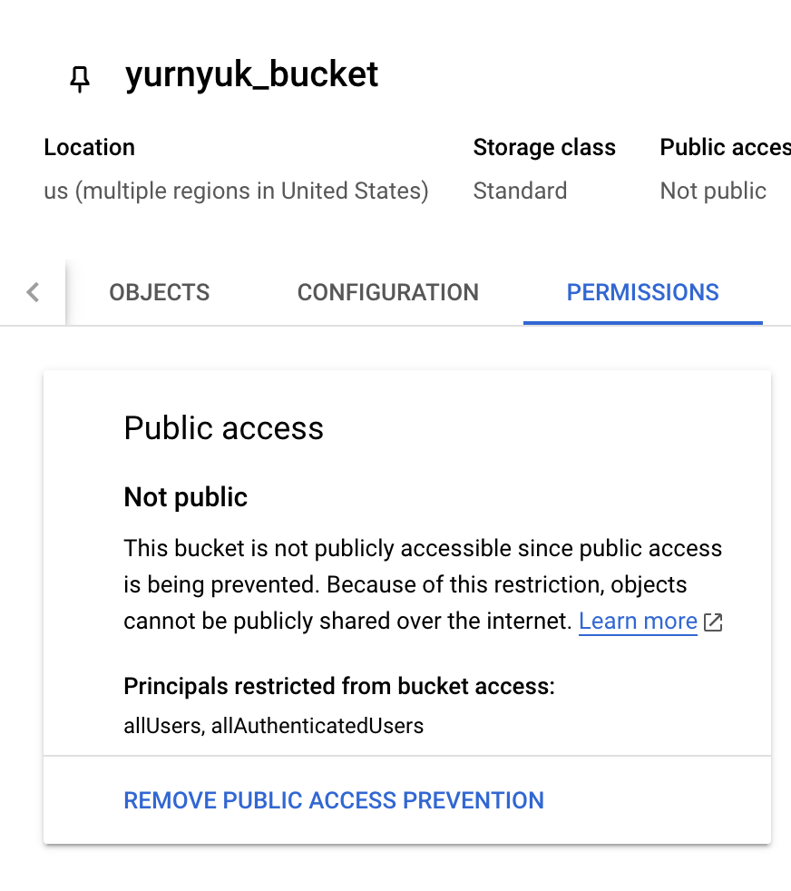

University: [ITMO University](https://itmo.ru/ru/) 

Faculty: [FICT](https://fict.itmo.ru)

Course: [Cloud platforms as the basis of technology entrepreneurship](https://itmo-ict-faculty.github.io/cloud-platforms-as-the-basis-of-technology-entrepreneurship/)

Year: 2024/2025

Group: U4225

Author: Yurnyuk Dmitry Olegovich

Lab: Lab3

Date of create: 23.03.2025

Date of finished: 24.03.2025

---

## Ход работ

Целью лабораторной работы является исследование возможностей Cloud Storage в Google Cloud Platform. В работе был создан bucket, загружены изображения, настроен публичный доступ и сгенерированы ссылки для общего доступа.

### Шаг 1: Выбор существующего проекта и создание Cloud Storage bucket
1. Перешел в раздел **Overview**.
2. Нажал **Create bucket** и создал bucket с именем `yurnyuk_bucket`:
   - Имя: `yurnyuk_bucket`
   - Размещение: `Multi-region`
   - Класс хранения: `Standard`
   - Управление доступом: `Uniform`

   

### Шаг 2: Загрузка изображений в Cloud Storage bucket
1. Перешел в созданный bucket `yurnyuk_bucket` и нажал **Upload files**.
2. Загрузил три изображения с именами:
   - `1.jpg`
   - `2 (1).jpg`
   - `4.jpg`

   

   

### Шаг 3: Создание папки и перемещение файлов
1. В bucket `yurnyuk_bucket` нажал **Create folder** и создал папку с именем `yurnyuk_folder`.

  
   
2. Переместил загруженные файлы в папку `yurnyuk_folder`, выбрав файлы и используя кнопку **Move**.

   

### Шаг 4: Настройка публичного доступа к файлам
1. Открыл **Permissions** я выполнил следующее:
   - Нашел элемент **Public access**.
   - Нашал **Remove Public Access Prevention**.
   - В окне нажал **Confirm**.

   

   
   
2. В той же вкладке **Permissions** для бакета `yurnyuk_bucket` выполнил следующие действия:
   - Нажал **Grant Access**.
   - Выбрал **Add principals**.
   - Добавил принципал `allUsers` с ролью **Storage Object Viewer**, чтобы сделать файлы публично доступными.
   - Сохранил изменения.

   

   

### Шаг 5: Создание ссылок на файлы
1. Для каждого файла в папке `yurnyuk_folder` нажал **More actions** и выбрал **Copy Public URL**.
2. Скопировал и сохранил ссылки на файлы для доступа:
   - [1.jpg](https://storage.googleapis.com/yurnyuk_bucket/yurnyuk_folder/1.jpg)
   - [2 (1).jpg](https://storage.googleapis.com/yurnyuk_bucket/yurnyuk_folder/2%20(1).jpg)
   - [4.jpg](https://storage.googleapis.com/yurnyuk_bucket/yurnyuk_folder/4.jpg)

   

## Выводы
В ходе лабораторной работы была изучена возможность создавать и настраивать Cloud Storage bucket, загружать и структурировать файлы, настраивать доступ и генерировать ссылки для общего доступа. Этот процесс позволяет организовать хранение и предоставление доступа к данным в облачной среде
